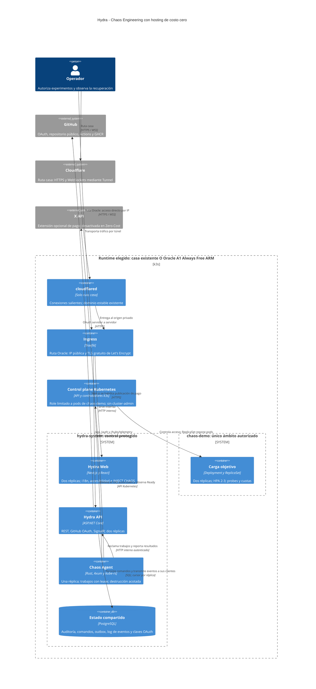

# Arquitectura C4 de Hydra

Estado: implementación inicial, 4 de octubre de 2026. El laboratorio local está desplegado y verificado; Oracle/Cloudflare requieren cuentas y validación en producción. [Evidencia](../validation/local-2026-10-04.md).

Se instala el mismo stack en una sola de las dos rutas. La ruta principal de producción usa Oracle Always Free ARM. La ruta doméstica usa hardware disponible y Cloudflare Tunnel; para un hostname estable necesita un dominio en Cloudflare. El frontend vive en el clúster para mantener el mismo origen de OAuth, REST y WebSockets.

La API Kubernetes pertenece al control plane, fuera de `chaos-demo`. El Role y el RoleBinding del agente se limitan a ese namespace: pods get/list/watch/delete y apps/replicasets get para comprobar ownership. El pipeline publica en GHCR y el clúster descarga las imágenes; no necesita acceso público a la API Kubernetes.

## Flujo de un experimento

1. GitHub OAuth identifica al usuario; Hydra aplica su propia autorización mediante una lista de operadores. Una cuenta de GitHub por sí sola no concede permiso para inyectar caos.
2. La interfaz envía `INJECT CHAOS` con una clave de idempotencia y el experimento autorizado. La API valida CSRF, límites de frecuencia, namespace, presupuesto de indisponibilidad y modo dry-run, y guarda un comando durable.
3. El agente reclama un trabajo mediante la API. La transacción PostgreSQL concede un lease; el comando conserva namespace, nombre y UID del pod elegido. Un reintento no selecciona otra víctima.
4. El agente verifica nuevamente el objetivo y sus permisos, y usa la precondición UID de Kubernetes en el DELETE. Solo puede borrar pods del laboratorio. La eliminación se confirma al observar la desaparición del UID; después espera la reposición y readiness. Un lease vencido exige reconciliar ese trabajo antes de permitir otro objetivo.
5. Cada réplica de la API lee el log de publicación con su propio cursor y transmite los eventos a sus clientes SignalR. El cliente deduplica y recupera eventos tras reconectar.
6. El evento produce un borrador de tweet. El adaptador X solo publica si el operador activa explícitamente la extensión de pago.

## Concurrencia y consumo

- PostgreSQL aloja una outbox y un log de publicación ordenado. La asignación del cursor de publicación se serializa bajo un lock transaccional; un identificador autoincremental de una transacción todavía sin commit no puede usarse como watermark seguro.
- Hydra implementa el fan-out sobre un log PostgreSQL, con polling y un cursor independiente por API. Todas las réplicas leen todos los eventos destinados a sus clientes; no compiten por el mismo evento. El log durable es la fuente de verdad.
- WebSockets exclusivo con `SkipNegotiation` elimina la necesidad de afinidad para esa conexión. Reconexión con jitter, cursor y snapshot cubre interrupciones; no se promete fallback SSE en Quick Tunnels. [SignalR y escalado](https://learn.microsoft.com/en-us/aspnet/core/signalr/scale?view=aspnetcore-10.0)
- Las claves Data Protection de las cookies OAuth se comparten y cifran entre réplicas. Los tokens OAuth de GitHub y Kubernetes permanecen en el servidor; el navegador recibe una cookie de sesión protegida. Los tweets nunca incluyen secretos ni datos de sesión.
- Colas y buffers tienen límites; métricas repetitivas se agregan para el navegador. La auditoría de una acción destructiva se persiste antes de ejecutarla. Si no hay espacio durable o lease válido, se rechaza el experimento.
- NetworkPolicy limita el ingreso a los componentes y aísla el laboratorio. El egress de `hydra-system` aún permite DNS, GitHub y la API Kubernetes sin restricciones por destino. Ejecución sin root, filesystem de solo lectura y service accounts separados. Solo el agente monta el token Kubernetes necesario.
- Startup, readiness y liveness probes tienen funciones separadas. La liveness no depende de PostgreSQL ni de GitHub, evitando reinicios por fallos externos.

## Dominios de fallo

El perfil mínimo recupera procesos y pods. Una VM, el control plane y PostgreSQL siguen siendo puntos únicos de fallo. Dos réplicas sobre un host no aseguran continuidad ante la pérdida de ese host. K3s con etcd en alta disponibilidad requiere al menos tres servidores; queda fuera del perfil Oracle mínimo. [K3s HA](https://docs.k3s.io/datastore/ha-embedded)

Una eliminación directa de pod no queda limitada por un PodDisruptionBudget; Hydra verifica su propio máximo de un pod no disponible antes de cada borrado. ReplicaSet restaura el número deseado: el lema de Hydra es una metáfora, no una regla de duplicación. [Disrupciones Kubernetes](https://kubernetes.io/docs/concepts/workloads/pods/disruptions/), [ReplicaSet](https://kubernetes.io/docs/concepts/workloads/controllers/replicaset/)

## Rutas de costo cero

- **Oracle:** una VM A1 de 2 OCPU/12 GB dentro de la cuota disponible, k3s autogestionado y frontend en el mismo clúster. Sin OKE ni servicios de pago obligatorios. [Oracle Always Free](https://docs.oracle.com/en-us/iaas/Content/FreeTier/freetier_topic-Always_Free_Resources.htm)
- **HTTPS Oracle sin dominio:** IP pública y certificados ACME de Let's Encrypt para IP, válidos 160 horas; renovación automática y verificación antes de habilitar OAuth. [Certificados por IP](https://letsencrypt.org/2026/01/15/6day-and-ip-general-availability)
- **Casa:** Cloudflare Tunnel en plan gratuito sobre equipo existente. El túnel estable requiere un dominio; su adquisición, electricidad y conectividad deben declararse como costos externos. Quick Tunnel queda para demos, sin garantía de uptime. [Requisitos Tunnel](https://developers.cloudflare.com/tunnel/get-started/), [Quick Tunnels](https://developers.cloudflare.com/tunnel/get-started/quick-tunnels/)
